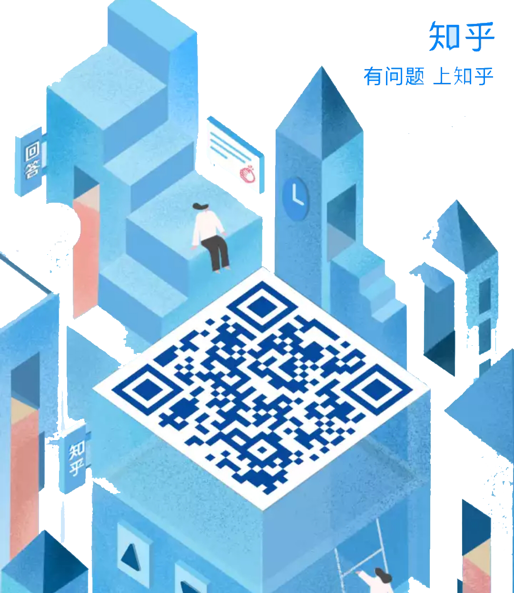
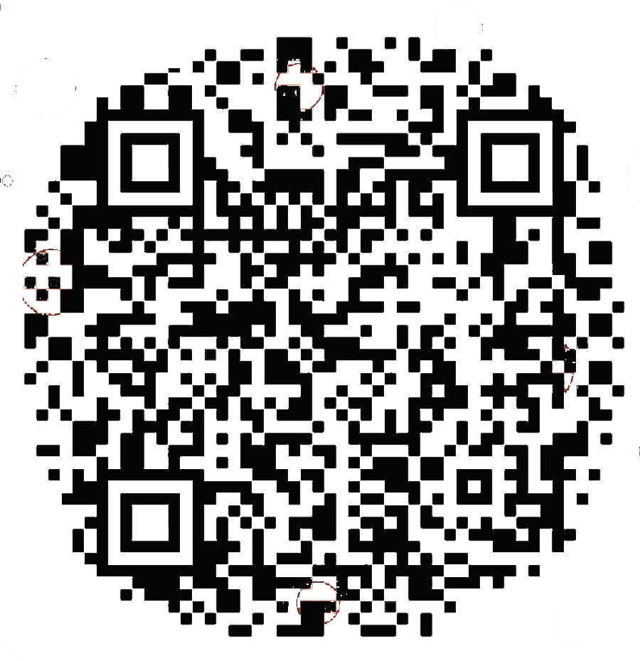
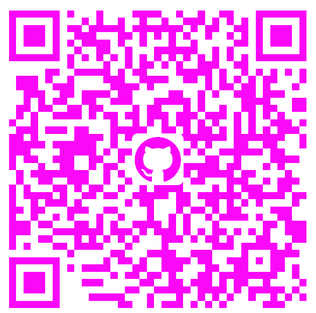
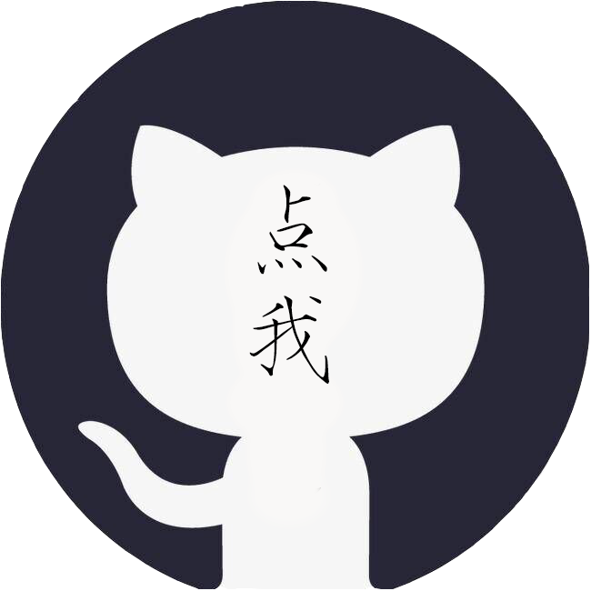

# HTML代码

```html
<!doctype html>
<html>

	<head>
		<meta charset="utf-8">
		<!-- 导入css文件 -->
		<link rel="stylesheet" type="text/css" href="styleSettings.css">
		<!-- 导入js文件 -->
		<script type="text/javascript" src="TagCoquetry.js"></script>
		<!-- 以下是网上找的设置动态背景和动态特效的js代码 -->
		<canvas id="canvas"></canvas>
		
		<canvas id="canvas1" style="whdth: 100%;height: 100%"></canvas>
		
		<script>
    		window.requestAnimationFrame = (function(){
        		return window.requestAnimationFrame ||
               	window.webkitRequestAnimationFrame ||
               	window.mozRequestAnimationFrame ||
               	function( callback ){
                    window.setTimeout( callback, 1000/2 );
               	};
    		})();
    		var myCanvas = document.getElementById("canvas");
    		var ctx = myCanvas.getContext("2d");//getContext 设置画笔
    		var num;
    		var w,h;
    		var duixiang = [];
    		var move = {};
    		function widthheight(){
        	w = myCanvas.width = window.innerWidth;
        	h = myCanvas.height = window.innerHeight;
			num= Math.floor(w*h*0.00028);//点的数量。根据屏幕大小确定
        	for(var i = 0;i < num;i++){
            	duixiang[i] = {
                	x:Math.random()*w,
                	y:Math.random()*h,
                	cX:Math.random()*0.6-0.3,
                	cY:Math.random()*0.6-0.3,
					R:Math.floor(Math.random()*5)+2,
					//CC:Math.floor(Math.random()*3)+2,
			    	r: Math.floor(Math.random() * 254),   
                	g: Math.floor(Math.random() * 254),  
                	b:Math.floor(Math.random() * 254)   
            	} 
           		// console.log(duixiang[i])
            	Cricle(duixiang[i].x,duixiang[i].y,duixiang[i].R,duixiang[i].r,duixiang[i].g,duixiang[i].b);
			 	//Cricle(duixiang[i].x,duixiang[i].y,duixiang[i].R,duixiang[i].CC);
        	}
    		};
			widthheight();//获取浏览器的等宽度等高
			function Cricle(x,y,R,r,g,b){
        		ctx.save();//保存路径
       			if(Math.random()>0.991) {ctx.globalAlpha= 0.9;}//ctx.fillStyle = "#CCC";}//填充的背景颜色
	    		else { ctx.globalAlpha=0.47;}
		 
				ctx.fillStyle = "rgb("+ r +","+ g +","+ b +")";
        		ctx.beginPath();//开始绘画
				ctx.arc(x,y,R,Math.PI*2,0);//绘画圆 x y 半径（大小） 角度  一个PI 是180 * 2 = 360    真假 0/1 true/false
        		ctx.closePath();//结束绘画
        		ctx.fill();//填充背景颜色
        		ctx.restore();//回复路径
    		};
			Cricle();


			!function draw(){
				ctx.clearRect(0,0,w,h)//先清除画布上的点
        		for(var i = 0;i < num;i++){
            		duixiang[i].x += duixiang[i].cX;
					duixiang[i].y += duixiang[i].cY;
            		if(duixiang[i].x>w || duixiang[i].x<0){
                		duixiang[i].cX = -duixiang[i].cX;
            		}
            		if(duixiang[i].y>h || duixiang[i].y<0){
                		duixiang[i].cY = -duixiang[i].cY;
            		}
            		Cricle(duixiang[i].x,duixiang[i].y,duixiang[i].R,duixiang[i].r,duixiang[i].g,duixiang[i].b);
            		//勾股定理判断两点是否连线
            		for(var j = i + 1;j < num;j++){
                		if( (duixiang[i].x-duixiang[j].x)*(duixiang[i].x-duixiang[j].x)+(duixiang[i].y-duixiang[j].y)*(duixiang[i].y-duixiang[j].y) <= 55*55 ){
                    		line(duixiang[i].x,duixiang[i].y,duixiang[j].x,duixiang[j].y,0,i,j)
                		}
                		if(move.x){
                    		if( (duixiang[i].x-move.x)*(duixiang[i].x-move.x)+(duixiang[i].y-move.y)*(duixiang[i].y-move.y) <= 100*100 ){
                        		line(duixiang[i].x,duixiang[i].y,move.x,move.y,1,i,1)
                    		}
                		}
            		}
        		}
        		window.requestAnimationFrame(draw)
    		}();

    		//绘制线条
    		function line(x1,y1,x2,y2,flag,i,j){
        
				if (flag){
					var color = ctx.createLinearGradient(x1,y1,x2,y2);
					ctx.globalAlpha=0.5;
					color.addColorStop(0,"rgb("+ duixiang[i].r +","+ duixiang[i].g +","+ duixiang[i].b +")");
					color.addColorStop(0.8,"#019ee5");
		        }
				else{
					var color = ctx.createLinearGradient(x1,y1,x2,y2);
					ctx.globalAlpha=0.9;
					color.addColorStop(0,"rgb("+ duixiang[i].r +","+ duixiang[i].g +","+ duixiang[i].b +")");
					color.addColorStop(1,"rgb("+ duixiang[j].r +","+ duixiang[j].g +","+ duixiang[j].b +")");
				}
        		ctx.save();
        		ctx.strokeStyle = color;
				ctx.lineWidth = 0.5;
        		ctx.beginPath();
        		ctx.moveTo(x1,y1);
        		ctx.lineTo(x2,y2);
        		ctx.stroke();
        		//ctx.restore();
    		}


    		//document.onmousemove = function(e){
     		//move.x = e.clientX;
      		//move.y = e.clientY;

    		//}
    		//console.log(move)//去掉注释 ，可以与背景互动

    		window.onresize = function(){
        		location.reload();
    		}
		</script>
		
		<script>
			var _createClass = function (){
				function defineProperties(target, props){ 
					for (var i = 0; i < props.length; i++){
	 					var descriptor = props[i];descriptor.enumerable = descriptor.enumerable || false;descriptor.configurable = true;
						if ("value" in descriptor) 
 							descriptor.writable = true;
						Object.defineProperty(target, descriptor.key, descriptor);
					}
				}
				return function (Constructor, protoProps, staticProps){
					if (protoProps) 
						defineProperties(Constructor.prototype, protoProps);
 					if (staticProps) 
						defineProperties(Constructor, staticProps);
 						return Constructor;
				};
			}();
			function _classCallCheck(instance, Constructor){
	 			if (!(instance instanceof Constructor)){
					throw new TypeError("Cannot call a class as a function");
				}
			}
 			var getRandom = function getRandom(min, max){
  				return Math.random() * (max - min) + min;
			};
			var getRandomInt = function getRandomInt(min, max){
  				return Math.floor(Math.random() * (max - min)) + min;
			};
			var getRandomColor = function getRandomColor(){
  				var colors = [
  					'rgba(231, 76, 60, 1)', // red
  					'rgba(241, 196, 15, 1)', // yellow
  					'rgba(46, 204, 113, 1)', // green
  					'rgba(52, 152, 219, 1)', // blue
  					'rgba(155, 89, 182, 1)' // purple
  				];
  				return colors[getRandomInt(0, colors.length)];
			};

			// Particle//粒子模块
			var Particle = function(){
				function Particle(system, x, y){
					_classCallCheck(this, Particle);
    				this.system = system;
    				this.universe = this.system.world.universe;
    				this.x = x;
    				this.y = y;
    				this.color = getRandomColor();
    				this.life = 1;
    				this.aging = getRandom(0.990, 0.999); // 0.99, 0.999 || 0.999, 0.9999

    				this.r = getRandomInt(12, 16);//初始粒子半径范围
    				this.speed = getRandom(18, 18.5);//粒子爆炸速度范围
    				this.velocity = [
    					getRandom(-this.speed, this.speed),
    					getRandom(-this.speed, this.speed)
					];

  			}
				_createClass(Particle, [
					{ 
						key: 'update', value: function update(dt){
      						this.life *= this.aging;

      						if(
								this.r < 0.1 ||
      							this.life === 0 ||
      							this.x + this.r < 0 ||
      							this.x - this.r > this.universe.width ||
      							this.y + this.r < 0 ||
      							this.y - this.r > this.universe.height){
        							this.system.removeObject(this);
      							}

 								this.r *= this.life;
      							this.x += this.velocity[0];
      							this.y += this.velocity[1];
    					}
					}, 
					{ 
						key: 'render', value: function render(ctx){
      						// Main circle //亮圈模块

      						ctx.fillStyle = this.color;
      						ctx.beginPath();
      						ctx.arc(this.x, this.y, this.r*1.2, 0, 2 * Math.PI, false);
      						ctx.fill();
      						ctx.closePath();

      						var r = this.color.match(/([0-9]+)/g)[0];
      						var g = this.color.match(/([0-9]+)/g)[1];
      						var b = this.color.match(/([0-9]+)/g)[2];

      						// Gradient//梯度变化曲线

      						var spread = 1.5;
      						var gradient = ctx.createRadialGradient(
      							this.x, this.y, this.r,
      							this.x, this.y, this.r * spread
							);

      						gradient.addColorStop(0, 'rgba(' + r + ', ' + g + ', ' + b + ', 0.5)');
      						gradient.addColorStop(1, 'rgba(' + r + ', ' + g + ', ' + b + ', 0)');

      						ctx.globalCompositeOperation = 'lighter';
      						ctx.fillStyle = gradient;
      						ctx.beginPath();
      						ctx.arc(this.x, this.y, this.r * spread, 0, 2 * Math.PI, false);
      						ctx.fill();
      						ctx.closePath();
      						ctx.globalCompositeOperation = 'source-over';

      						// Aberration//偏差

      						var offset = this.r * 0.5;
      						var color = 'rgba(' + g + ', ' + b + ', ' + r + ', 0.5)';

      						ctx.globalCompositeOperation = 'lighter';
      						ctx.fillStyle = color;
      						ctx.beginPath();
      						ctx.arc(this.x + offset, this.y + offset, this.r, 0, 2 * Math.PI, false);
      						ctx.fill();
      						ctx.closePath();
      						ctx.globalCompositeOperation = 'source-over';
    					}
					}
				]
				);
				return Particle;
			}();


			// Crown //水波纹圈模块
			var Crown = function (){

  				function Crown(system, x, y){
					_classCallCheck(this, Crown);
    				this.system = system;
    				this.x = x;
    				this.y = y;
    				this.r = getRandomInt(5, 15); // 5, 20  水波纹圈半径范围
    				this.mod = 1.1;
    				this.life = 0.5; //水波纹线
    				this.aging = getRandom(0.830, 0.899);
					this.speed = getRandom(8, 9);
    				this.color = {
						r: getRandomInt(236, 242),
      					g: getRandomInt(70, 80),
      					b: getRandomInt(50, 70) 
					};


    				this.angle1 = Math.PI * getRandom(0, 2);
    				this.angle2 = this.angle1 + Math.PI * getRandom(0.3, 0.4);//水波纹圈完整度
  			}
				_createClass(Crown, [
				{ 
					key: 'update', value: function update(dt){
      					this.life *= this.aging;

      					if (this.life <= 0.0001) 
							this.system.removeObject(this);

      					this.r += Math.abs(1 - this.life) * this.speed;

						this.x1 = this.x + this.r * Math.cos(this.angle1);
      					this.y1 = this.y + this.r * Math.sin(this.angle1);

      					this.angle3 = this.angle1 + (this.angle2 - this.angle1) / 2;
      					this.x2 = this.x + this.r * this.mod * Math.cos(this.angle3);
      					this.y2 = this.y + this.r * this.mod * Math.sin(this.angle3);
    				} 
				}, 
				
				{ 
					key: 'render', value: function render(ctx){
      					var gradient = ctx.createRadialGradient(
      						this.x, this.y, this.r * 0.9,
      						this.x, this.y, this.r
						);

      					gradient.addColorStop(0, 'rgba(' + this.color.r + ', ' + this.color.g + ', ' + this.color.b + ', ' + this.life + ')');
      					gradient.addColorStop(1, 'rgba(' + this.color.r + ', ' + this.color.g + ', ' + this.color.b + ', ' + this.life * 0.5 + ')');

      					ctx.fillStyle = gradient;
      					ctx.beginPath();
      					ctx.arc(this.x, this.y, this.r, this.angle1, this.angle2, false);
      					ctx.quadraticCurveTo(this.x2, this.y2, this.x1, this.y1);
      					ctx.fill();
      					ctx.closePath();
    				}
				}
			]);
				return Crown;
			}();


			// Explosion //爆炸模块
			var Explosion = function () {

  				function Explosion(world, x, y){
					_classCallCheck(this, Explosion);
    				this.world = world;
					this.x = x;
    				this.y = y;
    				this.objects = [];

    				var particles = getRandomInt(10, 30); // 10, 30 amount of particles//爆炸 粒子数量
    				var crowns = particles * getRandom(0.4, 0.5);

    				while (crowns-- > 0) {this.addCrown();}
    				while (particles-- > 0) {this.addParticle();}
  				}
				_createClass(Explosion, [
					{ 
						key: 'update', value: function update(dt){
      						this.objects.forEach(function (obj){
        						if (obj) obj.update(dt);
      						}
							);

      						if (this.objects.length <= 0){
        						this.world.clearExplosion(this);
      						}
    					} 
					}, 
					{ 
						key: 'render', value: function render(ctx){
      						this.objects.forEach(function (obj){
        						if (obj) obj.render(ctx);
      						}
							);
    					} 
					}, 
					{ 
						key: 'addCrown', value: function addCrown(){
      						this.objects.push(new Crown(this, this.x, this.y));
    					} 
					}, 
					{ 
						key: 'addParticle', value: function addParticle(){
      						this.objects.push(new Particle(this, this.x, this.y));
    					} 
					}, 
					{ 
						key: 'removeObject', value: function removeObject(obj){
      						var index = this.objects.indexOf(obj);

      						if (index !== -1){
        						this.objects.splice(index, 1);
							}
						} 
					}
				]);
				return Explosion;
			}();


			// World 
			var ConfettiWorld = function () {function ConfettiWorld(){
				_classCallCheck(this, ConfettiWorld);
			}
			_createClass(ConfettiWorld,[
				{ 
					key: 'init', value: function init(){
      					this.objects = [];
      					window.addEventListener('click', this.explode.bind(this));

      					// Initial explosion //初始爆炸
      					var counter = 0;
      					while (counter-- > 0){
        					this.explode({
          					clientX: window.event.clientX, //getRandomInt(10, this.universe.width) ,          //this.universe.width / 2,
          					clientY: window.event.clientY //getRandomInt(10, 50) //this.universe.height / 2 
		  				}
						);

      					}
    				} 
				}, 
				{ 
					key: 'update', value: function update(dt){
      					this.objects.forEach(function (obj) {
        					if (obj) obj.update(dt);
      					}
						);

      					var amount = this.objects.reduce(function (sum, explosion){
        					return sum += explosion.objects.length;
      					}, 
						0);
    				} 
				}, 
				{ 
					key: 'render', value: function render(ctx){
      					this.objects.forEach(function (obj){
        					if (obj) obj.render(ctx);
      					}
						);
    				} 
				}, 
				{ 
					key: 'explode', value: function explode(event){
      					var x = event.clientX;
      					var y = event.clientY;

      					this.objects.push(new Explosion(this, x, y));
    				} 
				}, 
				{ 
					key: 'clearExplosion', value: function clearExplosion(explosion){
      					var index = this.objects.indexOf(explosion);

      					if (index !== -1) {
        					this.objects.splice(index, 1);
      					}
    				}
				}
			]);
			return ConfettiWorld;}();


			// Time
			var Time = function(){

  				function Time(){
					_classCallCheck(this, Time);
    				this.now = 0; // current tick time
    				this.prev = 0; // prev tick time
    				this.elapsed = 0; // elapsed time from last tick
    				this.delta = 0; // time from last update
    				this.fps = 60; // desired fps
    				this.step = 1 / 60; // step duration
  				}
				_createClass(Time, [
					{ 
						key: 'update', value: function update(time){
      						this.now = time;
      						this.elapsed = (this.now - this.prev) / 1000;
      						this.prev = this.now;
							this.delta += this.elapsed;
    					} 
					}, 
					{ 
						key: 'raf', value: function raf(func){
      						window.requestAnimationFrame(func);
    					} 
					}, 
					{ 
						key: 'hasFrames', value: function hasFrames(){
      						return this.delta >= this.step;
    					} 
					}, 
					{ 
						key: 'processFrame', value: function processFrame(){
      						this.delta -= this.step;
    					} 
					}
				]);
				return Time;
			}();


				// Canvas
				var Universe = function (){

  					function Universe(element){
						_classCallCheck(this, Universe);
    					this.el = element;
    					this.ctx = this.el.getContext('2d');
    					this.pixelRatio = window.devicePixelRatio;
						this.time = new Time();

    					this.worlds = {};
    					this.world = null; // current state

    					this.updateSize();
    					window.addEventListener('resize', this.updateSize.bind(this));

    					this.addWorld('confetti', ConfettiWorld);
    					this.setWorld('confetti');

    					this.start();
  					}
					_createClass(Universe, [
						{ 
							key: 'start', value: function start(){
      							this.time.raf(this.tick.bind(this));
    						} 
						}, 
						{ 
							key: 'tick', value: function tick(time){
      							this.time.update(time);

      							if (this.time.hasFrames()){
        							this.update();
        							this.time.processFrame();
      							}

      							this.render();
      							this.time.raf(this.tick.bind(this));
    						} 
						}, 
						{ 
							key: 'update', value: function update(){
      							this.world.update(this.time.step);
    						} 
						}, 
						{ 
							key: 'render', value: function render(){
      							var gradient = this.ctx.createLinearGradient(0, 0, this.width, this.height);
      							this.ctx.clearRect(0, 0, this.width, this.height);
      							this.world.render(this.ctx);
    						}

    					// Helpers 库
  						}, 
						{ 
							key: 'updateSize', value: function updateSize(){
      							this.width = window.innerWidth;
      							this.height = window.innerHeight;
      							this.el.width = this.width * this.pixelRatio;
      							this.el.height = this.height * this.pixelRatio;
      							this.el.style.width = window.innerWidth + 'px';
      							this.el.style.height = window.innerHeight + 'px';
      							this.ctx.scale(this.pixelRatio, this.pixelRatio);
    						} 
						}, 
						{ 
							key: 'addWorld', value: function addWorld(worldName, World){
      							this.worlds[worldName] = new World();
      							this.worlds[worldName].universe = this;
      							this.worlds[worldName].init();
    						} 
						}, 
						{ 
							key: 'setWorld', value: function setWorld(worldName){
      							this.world = this.worlds[worldName];
    						} 
						}
					]);
					return Universe;
				}();


					// Main

					console.clear();
					var element = document.querySelector('#canvas1');
					window.Canvas= new Universe(element);
		</script>
		
		<!-- 网上找的代码到这儿为止 -->
		
		<!-- 标签标题 -->
		<title>ΔABCD の 个人主页</title>
		
		<!-- 背景音乐，建议使用 Edge浏览器，Chrome浏览器会禁用自动播放 -->
		<div style="margin-left: 5px; float: left;">
			<audio autoplay controls loop src="BGM.mp3"></audio>
		</div>
		
	</head>
	
	<body>
		<!-- 显示实时时间 -->
		<div id="datetime" style="margin-left: 475px; font-family:Cambria, Hoefler Text, Liberation Serif, Times, Times New Roman, serif;font-size: 42px;">
			<script>
				setInterval("document.getElementById('datetime').innerHTML=new Date().toLocaleString();", 1000);
			</script>
		</div>
		
		<!-- 大标题块 -->
		<div class="head">
			<div class="title_font_style">ΔABCD の Personal Blog</div>
		</div>
		
		<!-- 座右铭 -->
		<div class="motto_block">
			<div class="motto_font_style">给时光以生命 给岁月以文明</div>
		</div>
		
		<!-- 显示 点击页面 提示的块 -->
		<div class="tip">
			<div class="tip_font_style">点击本页面任意处都有惊喜哦 !</div>
		</div>
		
		<!-- 主体块，分为左中右 3 个部分 -->
		<div class="body_block">
		
			<!-- 左边的块，用于介绍个人基本信息 -->
			<div class="brief_introduction_on_the_left">
				<!-- 头像 -->
				<div class="introduction_font_style_1">PHOTO</div>
				<div style="margin-left: 50px;"></div>
				<!-- 基本信息 -->
				<div class="introduction_font_style_1" style="margin-top: 40px;">Introduction</div>
				<div class="introduction_font_style_2">Name: 王尧勇 ΔABCD</div>
				<div class="introduction_font_style_2">Gender: Male</div>
				<div class="introduction_font_style_2">Age: 19</div>
				<div class="introduction_font_style_2">来自浙江省绍兴市新昌县</div>
				<div class="introduction_font_style_2">现就读于南京理工大学</div>
				
				<!-- 文章链接 -->
				<div class="introduction_font_style_1" style="margin-top: 30px;">我的文章</div>
				
				<div class="introduction_font_style_2"><a href="article_1.html" target="_self">&#8226;C++新手村:自定义函数</a></div>
				<div class="introduction_font_style_2"><a href="article_5.html" target="_self">&#8226;对C++中指针、引用及数组名的简要讨论</a></div>
				<div class="introduction_font_style_2"><a href="article_6.html" target="_self">&#8226;C++中对象作为函数形参时的构造函数和析构函数</a></div>
				<div class="introduction_font_style_2"><a href="article_2.html" target="_self">&#8226;定积分在数列放缩中的应用</a></div>
				<div class="introduction_font_style_2"><a href="article_3.pdf" target="_self">&#8226;对数独魔方及其性质的研究</a></div>
				<div class="introduction_font_style_2"><a href="article_4.html" target="_self">&#8226;我是算数小天才java源代码</a></div>
				<div class="introduction_font_style_2"><a href="article_7.html" target="_self">&#8226;路线规划C++源代码</a></div>
				<div class="introduction_font_style_2"><a href="article_0.html" target="_self">&#8226;本网页源代码</a></div>
				
				<!-- 兴趣 -->
				<div class="introduction_font_style_1" style="margin-top: 30px;">兴趣领域</div>
				<div class="introduction_font_style_2">&#8226;计算机编程</div>
				<div class="introduction_font_style_2">&#8226;深度学习</div>
				<div class="introduction_font_style_2">&#8226;算法</div>
				<div class="introduction_font_style_2">&#8226;数学</div>
				<div class="introduction_font_style_2">&#8226;辩论</div>
				<div class="introduction_font_style_2">&#8226;科幻</div>
				
			</div>
			
			<!-- 中间的块，用于显示博客正文，目前暂无正文 -->
			<div class="passage">
				
				<div class="passage_font_style_1">震惊!生蚝的这个部位可不要吃，不仅难吃而且你根本吃不下去 !</div>
				<div class="passage_font_style_2">  各位爱吃生蚝的千万要知道，生蚝的外壳是不可以食用的。</div>
				<div class="passage_font_style_2">  生蚝外壳的主要成分是钙质和几丁质，结构和生蚝肉不同，因此质地十分坚硬，是不能消化吸收的部分，而且没什么味道，所以大家最好不要吃壳。</div>
				
				<div class="passage_font_style_1">无耻！上面这篇文章竟然是营销号！</div>
				<div class="passage_font_style_2">  上面这篇文章是营销号究竟是怎么一回事呢？营销号相信大家都很熟悉，但是营销号有特殊的文章风格是怎么回事呢，下面就让小编带大家一起了解吧。</div>
				<div class="passage_font_style_2">  营销号有特殊的文章风格，其实就是它因为风格特殊，大家可能会很惊讶营销号怎么会有特殊的文章风格呢？但事实就是这样，小编也感到非常惊讶。</div>
				<div class="passage_font_style_2">  这就是关于营销号有特殊的文章风格的事情了，大家有什么想法呢，欢迎在评论区告诉小编一起讨论哦！</div>
				
				<div class="passage_font_style_1">哦，我的上帝啊，凑字数真是太难了</div>
				<div class="passage_font_style_2">  哦，我的老伙计，上面两篇一定是用来凑字数的，我发誓,就是这样。哦，看在上帝的份上，我请求你，不要再做这种无聊的事情，你这个愚蠢的土拨鼠！还有什么会比这样子更加令人感到无耻呢？我发誓，这完全超出了我的想象。如果你再不停止，我会狠狠地踹你的屁股，我发誓，我会的。</div>
				
				<div style="margin-left: 75px; margin-top: 50px;"></div>
				
				<div class="passage_font_style_1" style="color:red; margin-top: 100px;">全世界的无产者联合起来！</div>
				<div class="passage_font_style_2" style="text-align: center;">是谁创造了人类世界？是我们劳动群众。</div>
				<div class="passage_font_style_2" style="text-align: center;">一切归劳动者所有，哪能容得寄生虫？</div>
				<div class="passage_font_style_2" style="text-align: center;">最可恨那些毒蛇猛兽，吃尽了我们的血肉。</div>
				<div class="passage_font_style_2" style="text-align: center;">一旦把它们消灭干净，鲜红的太阳照遍全球。</div>
				<div class="passage_font_style_2" style="text-align: center;">这是最后的斗争，团结起来到明天。</div>
				<div class="passage_font_style_2" style="text-align: center;">英特纳雄耐尔，就一定要实现！</div>
				
				<div class="passage_font_style_1" style="color:red; margin-top: 120px;">没有人比我更懂HTML</div>
				<div style="margin-left: 50px; margin-top: 20px;"></div>
				
			</div>
			
			<!-- 右边的块，用于展示个人的社交账号以及二维码 -->
			<div class="social_id_on_the_right">
				<div class="social_font_style_1">My Social Accounts</div>
				<!-- 知乎二维码及链接 -->
				<div style="margin-left: 90px; margin-top: 30px; opacity: 30;"></div>
				<div class="social_font_style_2"><a href="https://www.zhihu.com/people/rtsan-jiao-xing-abcd" target="_blank">知乎主页</a></div>
				
				<!-- QQ二维码 -->
				<div style="margin-left: 90px; margin-top: 30px; opacity: 30;"></div>
				<div class="social_font_style_2">QQ</div>
				
				<!-- 微信二维码 -->
				<div style="margin-left: 90px; margin-top: 30px; opacity: 30;"></div>
				<div class="social_font_style_2">微信</div>
				
				<!-- B站二维码及链接 -->
				<div style="margin-left: 90px; margin-top: 30px; opacity: 30;"></div>
				<div class="social_font_style_2"><a href="https://space.bilibili.com/226865405" target="_blank">B站主页</a></div>
				
				<!-- CodeForces主页链接 -->
				<div class="social_font_style_2"><a href="http://codeforces.com/profile/TriangleABCD" target="_blank">CodeForces主页</a></div>
				
				<!-- 洛谷用户名 -->
				<div class="social_font_style_2">洛谷用户名: △ABCD</div>
				
				<!-- 试图恰饭 -->
				<div style="margin-left: 90px; margin-top: 30px; opacity: 30;"></div>
				<div class="social_font_style_2">打赏专用支付宝收款码</div>
				
			</div>
			
		</div>
		
		<!-- 底部信息框 -->
		<div class="version_block">
			<div style="float: left; margin-left: 35px;"></div>
			<div>
				<!-- 版本信息 -->
				<div class="bottom_font_style">Copyright: &copy;2020-2021</div>
				<div class="bottom_font_style">Design &amp; Coding: ΔABCD(王尧勇) ；Helper: 马畅学长</div>
				<div class="bottom_font_style">南京理工大学-电光学院-新媒体中心-程序部</div>
				
				<!-- 外链 -->
				<div class="bottom_font_style">
					<a href="http://eoe.njust.edu.cn/" target="_blank">电光学院</a>
					<a href="http://dgxg.njust.edu.cn/_t1316/main.htm" target="_blank">电光20</a>
					<a href="http://dgxg.njust.edu.cn/_t1163/main.htm" target="_blank">电光19</a>
					<a href="http://dgxg.njust.edu.cn/_t900/main.htm" target="_blank">电光18</a>
					<a href="http://dgxg.njust.edu.cn/_t689/main.htm" target="_blank">电光17</a>
				</div>
				
			</div>
		</div>
		
		<!-- 悬浮块，暂无实际作用，用于表示我学过这个 -->
		<div class="float_block"></div>
		
	</body>
	
</html>

```

# CSS代码

```css
@charset "utf-8";
/* CSS Document */


/*设置悬浮块的位置*/
.float_block{
	position: fixed;
	top: 300px;
	right: 10px;
}

/*设置大标题框的位置、大小、颜色和边框效果*/
.head{
	margin-top: 0px;
	margin-left: 10px;
	margin-right: 10px;
	height: 80px;
	background-color: rgba(47,245,218,0.1);
	border-style: groove;
	border-radius: 15px;
}

/*设置大标题框中的文字颜色、字体、粗细、大小、居中方式*/
.title_font_style{
	color: purple;
	font-family:Cambria, Hoefler Text, Liberation Serif, Times, Times New Roman, serif;
	font-weight: 500;
	font-size: 60px;
	margin-left: 400px;
}

.motto_block{
	margin-top: 2px;
	margin-left: 10px;
	margin-right: 10px;
	height: 50px;
	background-color:rgba(125,13,248,0.2);
	border-style: groove;
	border-radius: 15px;
}

.motto_font_style{
	color:navy;
	font-family:Consolas, Andale Mono, Lucida Console, Lucida Sans Typewriter, Monaco, Courier New, monospace;
	font-weight: 500;
	font-size: 40px;
	text-align: center;
}

/*设置提示框的位置、大小、颜色和边框效果*/
.tip{
	margin-top: 2px;
	margin-left: 10px;
	margin-right: 10px;
	height: 25px;
	background-color: rgba(235,230,95,0.1);
	border-style: groove;
	border-radius: 15px;
}

/*设置提示框中的文字颜色、字体、粗细、大小、居中方式*/
.tip_font_style{
	color: coral;
	font-family:Consolas, Andale Mono, Lucida Console, Lucida Sans Typewriter, Monaco, Courier New, monospace;
	font-weight:500;
	font-size: 15px;
	text-align: center;
}

/*设置主体框的位置、大小、颜色和边框效果*/
.body_block{
	margin-top: 2px;
	margin-left: 10px;
	margin-right: 10px;
	height: 2000px;
	background-color: rgba(255,255,255,0.1);
	border-style: groove;
	border-radius: 15px;
}

/*设置大主体框中左边的介绍框的位置、大小、颜色和边框效果*/
.brief_introduction_on_the_left{
	margin-top: 5px;
	margin-left: 5px;
	width: 300px;
	height: 1990px;
	background-color: rgba(235,106,243,0.1);
	border-style: groove;
	border-radius: 15px;
	float: left;
}

/*设置介绍框中的文字颜色、字体、粗细、大小、居中方式*/
.introduction_font_style_1{
	margin-top: 10px; 
	text-align:center; 
	color: purple; 
	font-family:Cambria, Hoefler Text, Liberation Serif, Times, Times New Roman, serif; 
	font-weight: 500; 
	font-size: 25px;
}

.introduction_font_style_2{
	margin-top: 20px;
	margin-left: 20px;
	color:darkslateblue;
	font-family:Consolas, Andale Mono, Lucida Console, Lucida Sans Typewriter, Monaco, Courier New, monospace;
	font-weight: 500;
	font-size: 20px;
}

/*设置大主体框中间的正文框的位置、大小、颜色和边框效果*/
.passage{
	margin-top: 5px;
	margin-left: 3px;
	width: 800px;
	height: 1990px;
	background-color: rgba(236,117,117,0.1);
	border-style: groove;
	border-radius: 15px;
	float: left;
}

/*设置正文框中的文字颜色、字体、粗细、大小、居中方式*/
.passage_font_style_1{
	margin-top: 10px; 
	text-align:center; 
	color: purple; 
	font-family:Consolas, Andale Mono, Lucida Console, Lucida Sans Typewriter, Monaco, Courier New, monospace; 
	font-weight: 1000; 
	font-size: 25px;
}

.passage_font_style_2{
	margin-top: 15px;
	margin-left: 10px;
	font-family:Consolas, Andale Mono, Lucida Console, Lucida Sans Typewriter, Monaco, Courier New, monospace;
	font-weight: 500;
	font-size: 15px;
}

/*设置大主体框中右边的社交媒体链接框的位置、大小、颜色和边框效果*/
.social_id_on_the_right{
	margin-top: 5px;
	margin-left: 1120px;
	margin-right: 5px;
	height: 1990px;
	background-color: rgba(193,12,243,0.1);
	border-style: groove;
	border-radius: 15px;
}

/*设置社交框中的文字颜色、字体、粗细、大小、居中方式*/
.social_font_style_1{
	margin-top: 10px; 
	text-align:center; 
	color:orange; 
	font-family:Consolas, Andale Mono, Lucida Console, Lucida Sans Typewriter, Monaco, Courier New, monospace; 
	font-weight: 800; 
	font-size: 25px;
}

.social_font_style_2{
	margin-top: 20px;
	margin-left: 20px;
	color:tomato;
	font-family:Consolas, Andale Mono, Lucida Console, Lucida Sans Typewriter, Monaco, Courier New, monospace;
	font-weight: 500;
	font-size: 20px;
	text-align: center;
}

/*设置底部版本等信息框*/
.version_block{
	margin-top: 2px;
	margin-left: 10px;
	margin-right: 10px;
	height: 80px;
	background-color:rgba(6,197,245,0.3);
	border-style: groove;
	border-radius: 15px;
}

/*设置底部字体样式*/
.bottom_font_style{
	font-family:Consolas, Andale Mono, Lucida Console, Lucida Sans Typewriter, Monaco, Courier New, monospace;
	font-weight: 300;
	font-size: 15px;
	text-align: center;
}


/*以下设置了背景效果*/
*{
	margin: 0;
	padding: 0;
}
#canvas{
	position: fixed;
	background: #ccc;
	overflow: auto;
	z-index: -1;
}


#canvas1{
	position: fixed;
	pointer-events:none;
	width: 100%;
	height: 100%;
	overflow: auto;
	z-index: 999;

}
```

# JavaScript代码

```javascript
// JavaScript Document


//以下用于设置标签的病娇效果
window.onblur = function(){
	var a = document.getElementsByTagName("title")[0];
	a.innerHTML = "亲,别走啊~";
};

var c = 0;
window.onfocus = function(){
	var b = document.getElementsByTagName("title")[0];
	var s = new Array("死鬼,想我啦 !","ΔABCD の 个人主页","你还知道回来 !","人家好想你呢~");
	b.innerHTML = s[c%4];
	c = c + 1;
	
};

//以下设置悬浮快的改变效果
var b = 0;
function f(){
	var a = document.getElementById("t");
	var s = new Array("Github2.png","Github3.png","Github4.png","Github1.png");
	var size = new Array("200","300","400","100");
	a.src = s[b%4];
	a.width = size[b%4];
	a.height = size[b%4];
	b=b+1;
}

```

